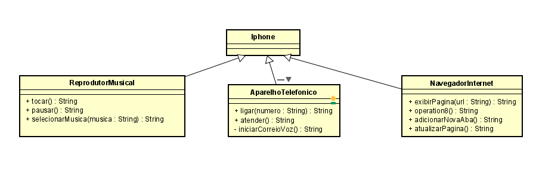

## Getting Started

Esse projeto consiste em representar funcionalidades do Iphone no paradigma orientado a objetos - POO.
O objetivo do projeto é treinar o uso de interfaces.

## Folder Structure

The workspace contains two folders by default, where:

- `src`: the folder to maintain sources
- `lib`: the folder to maintain dependencies
- `funcionalidades`: contém as interfaces que simulam as funcionalidades do iphone.

Meanwhile, the compiled output files will be generated in the `bin` folder by default.

> If you want to customize the folder structure, open `.vscode/settings.json` and update the related settings there.

## Dependency Management

The `JAVA PROJECTS` view allows you to manage your dependencies. More details can be found [here](https://github.com/microsoft/vscode-java-dependency#manage-dependencies).

## Class UML

